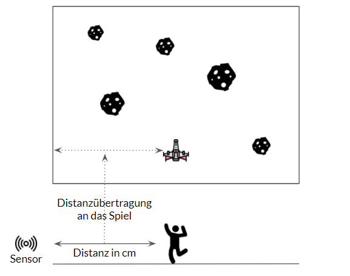
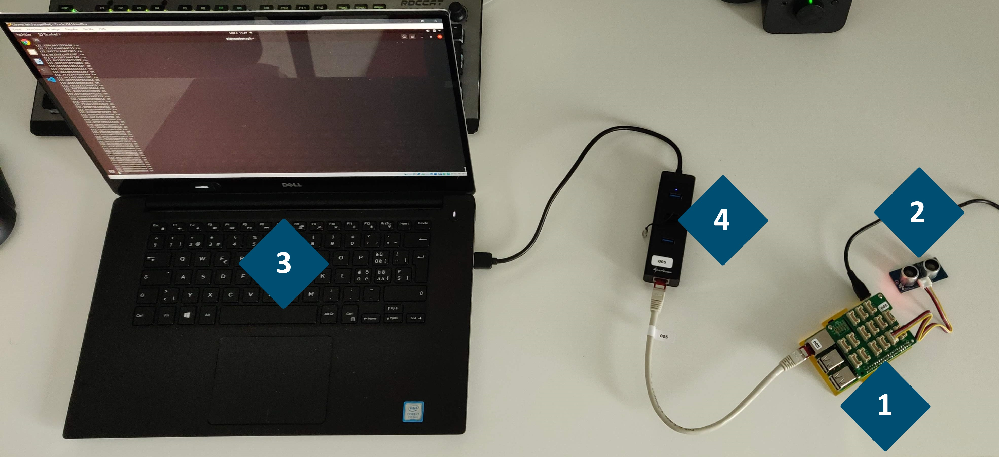
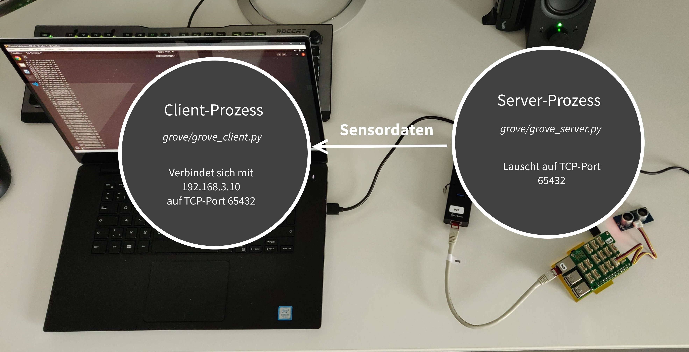
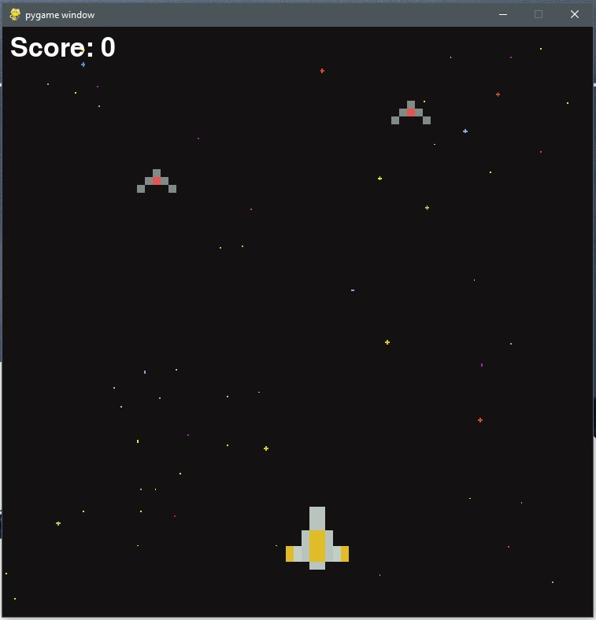

# Space Invaders with grove.py
========

[](https://travis-ci.org/Seeed-Studio/grove.py)
[](https://pypi.python.org/pypi/grove.py)

Python library for Seeedstudio Grove Devices on embeded Linux platform, especially good on below platforms:
- [Coral Dev Board](https://www.seeedstudio.com/Coral-Dev-Board-p-2900.html) [(Wiki)](http://wiki.seeedstudio.com/Grove_Base_Hat_for_Raspberry_Pi/#software)
- [NVIDIA Jetson Nano](https://www.seeedstudio.com/NVIDIA-Jetson-Nano-Development-Kit-p-2916.html) [(Wiki)](http://wiki.seeedstudio.com/Grove_Base_Hat_for_Raspberry_Pi/#software)
- [Raspberry Pi](https://www.seeedstudio.com/category/Boards-c-17.html) [(Wiki)](http://wiki.seeedstudio.com/Grove_Base_Hat_for_Raspberry_Pi/#software)

<br><br>
## The Idea
The thought was to integrate some IOT-device into a small game. In this project, a distance sensor is used to track the player's physical position. This position is then applied to the game's space ship character, that way, the player can move a digital object with real life body movements.



<br><br>
## Hardware setup
1.  Raspberry Pi
2.  [Grove Ultrasonic Ranger](https://wiki.seeedstudio.com/Grove-Ultrasonic_Ranger/)
3.  Host
4.  USB-Ethernet Adapter + RJ45



<br><br>
## Data Communication
The Raspberry (which is connected to the sensor) sends the sensor data through a socket connection to the host. When the host runs the game (grove/space_slide_invaders.py) it fetches the sensor data through the client script (grove/grove_client.py) and applies it to the game character.



<br><br>
## The Final Look of the Game
When everything is up and running, the yellow space ship should be controllable by the player's body movements, by moving closer to or farther away from the Ultrasonic ranger sensor.  



<br><br>
## Installation on Raspberry Pi and Host
### Install pygame
```shell
python3 -m pip install -U pygame --user
```
### Install grove.py
```shell
git clone https://github.com/yruefenacht/grove.py
cd grove.py
# Python2
sudo pip install .
# Python3
sudo pip3 install .
```

<br><br>
## Usage
Run grove server on Raspberry
```shell
python grove/grove_server.py 5 6
```
Run space slide invaders on Host
```shell
python grove/space_slide_invaders.py
```

<br><br>
## API Documentation
Seeedstudio documentation is available [here](https://seeed-studio.github.io/grove.py)
